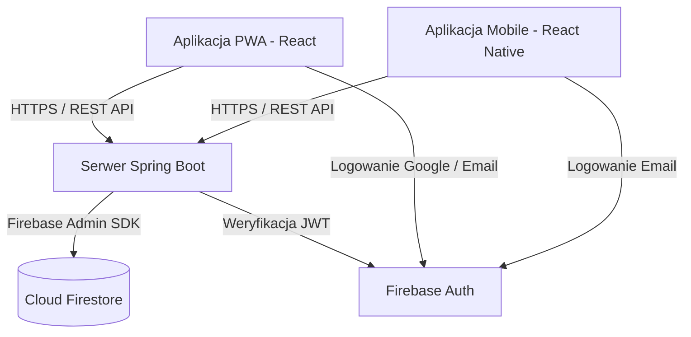

# WebApps Board - System Zarządzania Zadaniami

## 1. Opis aplikacji
WebApps Board to nowoczesna aplikacja wspierająca organizację pracy grupowej, działająca jako klon tablic typu Kanban (np. Jira, Trello). Cel projektu to umożliwienie zespołom błyskawicznego tworzenia przestrzeni roboczych, dodawania zadań i śledzenia ich statusów w czasie rzeczywistym.

Grupa docelowa to studenci, grupy projektowe oraz niewielkie zespoły deweloperskie szukające lekkiego i szybkiego narzędzia bez zbędnego "bloatware'u".

**Główne funkcjonalności:**
- Logowanie i rejestracja (Firebase Auth).
- Tworzenie zespołów, dołączanie za pomocą ID oraz ich usuwanie.
- Tablica zadań (TODO, IN_PROGRESS, DONE).
- Przypisywanie prawdziwych członków zespołu do konkretnych zadań.
- Określanie priorytetów (LOW, MEDIUM, HIGH).

## 2. Architektura systemu
System oparty jest o architekturę klient-serwer. Logika biznesowa została całkowicie scentralizowana po stronie serwera, co pozwala na pełną synchronizację danych pomiędzy aplikacją mobilną a webową.



## 3. Wybrana technologia
* **Backend:** Java + Spring Boot. Wybrano ze względu na silne typowanie, niezawodność, łatwość tworzenia filtrów bezpieczeństwa (Spring Security) i dobrą integrację z Google Cloud.
* **Baza danych:** Google Cloud Firestore (NoSQL). Ze względu na to, że tablice zadań mają bardzo dynamiczną strukturę (łatwo dodawać nowe pola do zadań), baza dokumentowa pozwalała na znacznie szybszy development niż klasyczny SQL.
* **Frontend (PWA):** React (Vite). React oferuje świetny system komponentów, co sprawdziło się przy drag&drop, a `vite-plugin-pwa` zredukował konfigurację Service Workera do minimum.
* **Mobile:** React Native (Expo). Umożliwiło to natychmiastowy build na Androida i iOS używając tylko języka JavaScript, dzieląc mnóstwo wiedzy i logiki ze struktury napisanej dla PWA.

## 4. Opis API
Komunikacja odbywa się przez REST API. Każde żądanie (z wyjątkiem ewentualnych testowych) musi zawierać nagłówek `Authorization: Bearer <JWT>`.

**Zespoły (`/api/teams`):**
* `GET /` - Pobiera listę zespołów, do których należy użytkownik.
* `POST /` - Tworzy nowy zespół z podaną nazwą.
* `POST /{teamId}/join` - Dołącza zalogowanego użytkownika do zespołu na podstawie ID.
* `DELETE /{teamId}` - Usuwa zespół bezpowrotnie (i jego zadania).
* `GET /{teamId}/members` - Zwraca zmapowaną listę członków (uid, email, displayName).

**Zadania (`/api/teams/{teamId}/tasks`):**
* `GET /` - Pobiera wszystkie zadania dla danego zespołu.
* `POST /` - Dodaje nowe zadanie (np. do kolumny TODO).
* `PUT /{taskId}` - Aktualizuje treść, status (kolumnę), osobę przypisaną lub priorytet zadania.
* `DELETE /{taskId}` - Kasuje pojedyncze zadanie.

## 5. Design system
Zdecydowałem się na popularny obecnie i estetyczny **Glassmorphism** w trybie **Dark Mode**.
* **Kolorystyka:** Główne tło to ciemny granat (`#0f172a`), panele i karty są lekko przezroczyste (`rgba(30, 41, 59, 0.8)`). Akcenty (przyciski, aktywne kontrolki) mają kolor niebieski (`#3b82f6`). Elementy destrukcyjne (usuwanie) to zgaszona czerwień (`#ef4444`).
* **Typografia:** Bezszeryfowe fonty systemowe (Inter, Roboto), kładące nacisk na wysoki kontrast – nagłówki i główny tekst w kolorze białym (`#ffffff`), a informacje poboczne (ID zespołu, szare opisy) z użyciem odcieni szarości (np. `#94a3b8`).
* **Komponenty UI:** Karty z lekkim obramowaniem `border: 1px solid rgba(255,255,255,0.1)`, miękkie cienie (box-shadow) symulujące głębię 3D.

## 6. Opis funkcjonalności
1. **Rejestracja i logowanie:** Wspiera logowanie kontem Google na PC oraz E-mailem na platformach mobilnych (własny ekran pozyskujący imię/nazwisko rejestrowanego usera).
2. **Dashboard zespołów:** Pokazuje kafelki zespołów. Użytkownik widzi ID do skopiowania i wysłania innym. Może łatwo założyć nowy, lub dołączyć wklejając kod.
3. **Tablica Kanban (PWA):** Trzy kolumny zadań. Rozbudowany system przeciągania i upuszczania (Drag & Drop) automatycznie aktualizujący status na backendzie.
4. **Tablica Mobilna:** Lista zadań. Otwarcie zadania wyświetla modal na cały ekran (Jira-style), w którym statusy, priorytety i przypisania zmienia się nowoczesnymi "chispami" (kafelkami jedno-wyboru).
5. **Dynamiczny dropdown użytkowników:** Przy przypisywaniu zadania, aplikacja odpytuje serwer, podmieniając nudne kody UUID na prawdziwe imiona uczestników.

## 7. Zabezpieczenia
* **Bezstanowe JWT (Stateless Token Authentication):** Sesje nie są trzymane w pamięci serwera. Każdy request jest na żywo sprawdzany przez `FirebaseTokenFilter` sprawdzający integralność kryptograficzną dostarczonego przez klienta Bearer Tokena.
* **Reguły Firestore:** Serwer Java operuje na kluczach serwisowych (Admin SDK), przez co klienci z zewnątrz (np. ze spreparowanego kodu JS) nie mają bezpośredniego dostępu do bazy. Cały ruch idzie przez nasze ściśle obwarowane API.
* **CORS:** Skonfigurowano polityki CORS dla endpointów w taki sposób, aby zapobiegać nadużyciom z nieznanych domen w środowisku deweloperskim i produkcyjnym.
* 
## 9. Zrzuty ekranu

## 10. Instrukcja uruchomienia

### Krok 1: Backend (Java/Spring Boot)
W katalogu backendu musi znajdować się wygenerowany plik `serviceAccountKey.json` (z uprawnieniami Admin SDK z Firebase Console).
```bash
cd backend
mvn clean install
mvn spring-boot:run
```
Serwer uruchomi się domyślnie na porcie `:8080`.

### Krok 2: PWA (Vite + React)
Należy upewnić się, że `API_URL` w pliku `api.js` wskazuje na port 8080 (lub domenę z Render).
```bash
cd pwa
npm install
npm run dev
```

### Krok 3: Aplikacja Mobilna (Expo)
Wymaga zainstalowanej na telefonie aplikacji "Expo Go".
```bash
cd mobile
npm install
npx expo start
```
Zeskanuj wygenerowany kod QR z poziomu Expo Go na swoim telefonie.

## 11. Napotkane problemy
* **Problem z danymi uczestników:** Token JWT autoryzującego użytkownika na serwerze nie zawsze niósł za sobą jego dane osobowe (np. gdy konto było surowo stworzone w bazie przez e-mail). Samo UID nie wystarczało, żeby ładnie zaprezentować w PWA tekst: `Przypisane do: Jan Kowalski`.
  *Rozwiązanie:* Implementacja po stronie Spring Boot zapytań przez Firebase Admin SDK (`FirebaseAuth.getInstance().getUser(uid)`), które dograbiają z bazy Firebase autentyczne imiona/emaile i oddają spłaszczoną, czystą listę członków klientowi.

## 12. Możliwości rozwoju
Aplikacja ma stabilny fundament, natomiast do jej profesjonalnego, komercyjnego wdrożenia można pomyśleć o:
1. **Systemie Komentarzy** - Możliwość dodania historii konwersacji wewnątrz modala szczegółów zadania.
2. **Załączniki** - Wpięcie modułu Firebase Cloud Storage, by uploadować pliki, kody lub screeny do tasków.
3. **Role i uprawnienia** - Przypisywanie ról "Admin" i "Member", by tylko założyciel grupy miał moc usunięcia zespołu albo wykluczania konkretnych użytkowników.
